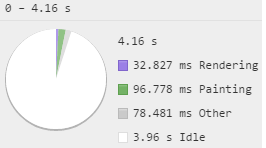
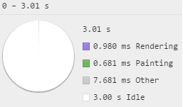
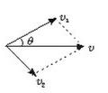
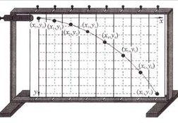
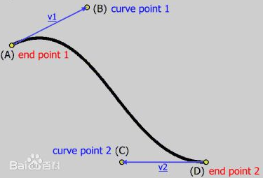
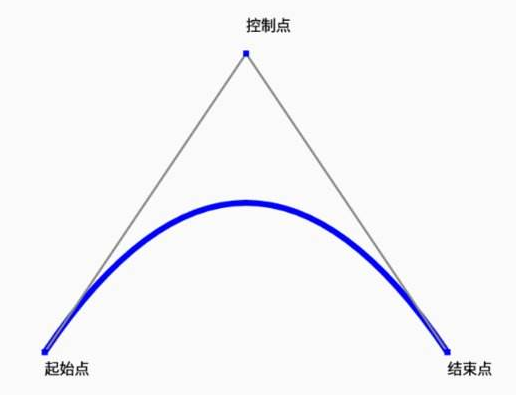
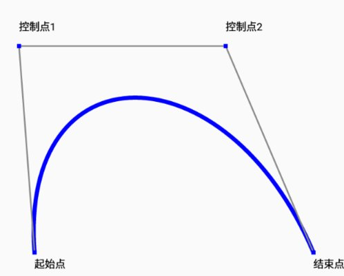
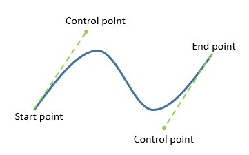
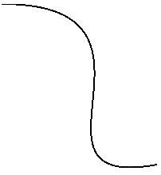

# 附近有闲的纸飞机
附近有闲，发送信息叫纸飞机，所以希望发送信息完毕之后，出现一个纸飞机的飞行轨迹。
动画的实现方式很多种，大部分人想到jq的amination，css3的amination和transition
## 二维码

# 需求来源
最近一个小程序项目，附近有闲。发送信息叫“纸飞机”，所以希望发送信息完毕之后，出现一个纸飞机的飞行轨迹。
## 
1. 纸飞机需要平滑的运动
2. 有多种飞行方式
# 纸飞机飞翔动画
## 1.	css3动画
动画的实现方式很多种，大部分人想到jq的amination，css3的amination和transition
### 1)	position vs transform
> 
> 
>
> 对比一下，左边是布局方式的left和top，右边是transform的translate，尤其是绘画和渲染简直天差地别。看了chrome的专业介绍，transform会走硬件加速，就是机器的显卡越好，这个差距越明显。
### 2)	运动动画
> 回过来继续说飞机。
>
> 我们写个飞机飞行的css3，让飞机从0px飞到1000px
```css
@keyframes move {
  from {transform: translateX(0px)}
  to {transform: translateX(1000px)}
}
```
> 然后给标签应用动画，让标签播放动画，10秒播放完毕。
```css
#plane {
    animation: move 10s linear;
    width: 100px;
    height: 500px;
}
```
> 动画虽然播放了，可是设计的要求肯定不是让你这么直直的飞，效果太差了。但是css3只能这么弄，我们加上translateY就可以斜着飞了，貌似这是极限了。
```css
@keyframes move {
  from {transform: translate(0px, 0px)}
  to {transform: translate(1000px, 500px)}
}
```
### 3)	运动合成
> 实际上，我们的思维不能这么局限，回想一下中学的物理和数学。
> 
> 
> 
>
> 速度是可以分解的，v等于v1和v2的合成。
>
> 再想想著名的平抛运动——x轴做匀速直线运动，y轴做自由落体运动（重力加速运动）
>
> 我们也可以分两个div，一个大div套着小div。
```html
<div id="plane">
    <div id="entity"></div>
</div>
```
> 设置一个y的运行0px到500px
```css
@keyframes falling {
    from {transform: translateY(0px)}
    to {transform: translateY(500px)}
}
```
> 注意动画这里，虽然还是10秒完成动画，但是用了淡入，就是先慢后快。
```css
#entity {
    animation: falling 10s ease-in;
    width: 50px;
    height: 50px;
}
```
> 我们也可以改变一下这个动画方式，比如改成5秒执行两次并且反弹
```css
animation: falling 5s ease-in alternate 2;
```
> 其他的方式就更多了，总之就是看你怎么组合了。
## 2.	canvas动画
> 但是我们的纸飞机不能就这么一种飞法啊。
>
> 设计小姐姐给我们提出了要多几种飞行方式，可是每一种方式要调整到设计满意的样子都很难，更别说是那么多种飞行方式了。如果设计妥协，那我们的产品精致程度就要大打折扣。
>
> 我们这时候重新捋一遍，设计做的效果肯定是有各种软件，其实软件也是把数据做了渲染。我们是否可以把设计做好的东西里面直接把数据应用到我们的开发中呢？这样肯定是还原了设计，并且修改成本非常低。
>
> 其实设计就是画了一条线，然后拉成曲线，就是我们常说的贝塞尔曲线。
>
> 
>
> 是不是听了很懵逼 
>
> 
>
> 不用想那么多了
>
> 我封装了一个game.class.js类，你只需要在引用就行了。以后我们也多多这种类，别人初始化用一下就行了，根本不用去理解你怎么完成的。（这个类是小程序专用，h5需要修改）
```js
var context = wx.createCanvasContext('aeroplane', this);//构造画布
var game = new Game.main(context);//构造game类
game.setPlane(plane);
game.launch(bezier);//启动
```
> Context就是canvas的context，你可以随意创建一个
>
> Plane是飞机的数据有地址和宽高。
```json
plane: {
  url: "/static/images/3.png",
  width: 80,
  height: 77.6
}
```
> Bezier就是一个数组，里面放三个坐标就是二次贝塞尔，四个坐标就是三次贝塞尔
```json
cube: [ //三次贝塞尔
  {
    x: -20,
    y: 600,
    z: 1
  },
  {
    x: 200,
    y: 500,
    z: 1
  },
  {
    x: 250,
    y: 300,
    z: .5
  },
  {
    x: 300,
    y: 50,
    z: .5
  }
],
square: [ //二次贝塞尔
  {
    x: 0,
    y: 200
  },
  {
    x: 100,
    y: 0
  },
  {
    x: 200,
    y: 200
  }
],
```
> 有了这些，就可以随意的生成小飞机动画了。
# 三、	动画解析
> 但是有些童鞋，表示——我就喜欢刨根问底，告诉我怎么做的！
>
> 好，我们一步步来。
## 1.	二次贝塞尔曲线
> 
>
> 其实就是给起始点和结束点中间加了一个控制点。
>
> 公式为：
> 
## 2.	三次贝塞尔曲线
> 
>
> 其实就是给起始点和结束点中间加了两个控制点。
>
> 公式为：
> 
>
> 由于有了两个控制点，可以更随意的绘制路径。
> 
## 3.	函数解析
> 所谓的公式其实就是函数（function），比如这个公式，就是一个叫B的函数，参数为t，t的取值范围是0~1，p0~3这里其实是常数，因为在变化过程中他是不变的。
>
> 我们拿个实际例子吧。
>
> 开始位置为（-20,600）
>
> 第一个控制点为（200,500）
>
> 第二个控制点为（250,300）
>
> 结束点为（300,50）
>
> 我们用公式算出点
```js
t=0.1
x = -20*(1-0.1)3 + 3*200 * 0.1*(1-0.1)2 +3* 250*0.12*(1-0.1)+300*0.13
y = 600*(1-0.1)3 + 3*500 * 0.1*(1-0.1)2 +3* 300*0.12*(1-0.1)+50*0.13
t=0.5
x = -20*(1-0.5)3 + 3*200 * 0.1*(1-0.5)2 +3* 250*0.12*(1-0.5)+300*0.13
y = 600*(1-0.5)3 + 3*500 * 0.1*(1-0.5)2 +3* 300*0.12*(1-0.5)+50*0.13
……
```
> 这样，所有点的集合为这样的一条贝塞尔曲线。
> 
> 
>
> 既然画线知道了，我们把所有点做为飞机的做标来设置就可以了，并且t与时间相匹配，比如setinterval，设置300毫秒执行一次飞机定位，并且t+=0.1，于是就完成了一个动画，如果想让动画更连贯，最好用requestAnimationFrame，并且分段更细一点。
>
> 这样设计只要做出满意的动画轨迹，然后把关键点的做标给技术，马上动画就完成了。并且t最好也用缓动来完成，因为飞机开始起飞慢，中间快，最后停下又慢。
## 4.	反三角函数
> 但是飞机飞行时候不是一直水平的，它是按照曲线的切线运动的。这个怎么实现呢？就要用我们的反三角函数了。
>
> 
> 不对，是反→
> 
>
> 
>
> 我们知道当前的坐标，又知道上一个坐标，然后yt-y0和xt-x0就是三角函数的值，把这个用反三角函数就可以求出角度（其实是弧度）了，然后让其旋转。
```js
let r = Math.atan2(p.y - yt, p.x - xt);
_context.rotate(r);
```
> 记住，一定要用atan2不要用atan，那个只能算出π/2之内的值。
# 四、	总结
> 总的来说我们的思维要开阔一些。其实自己深度不够没事，我们可以增加我们的深度；最怕的是都不知道可以往某个方面去想，所以我们要多增加点交流，技术储备就会越来越多。
# 京东商城-拍拍二手团队
> 诚招高级前端研发工程师，web，app方向均可
>
> 做标：京东集团总部，地铁旁边，全程班车
>
> 要求：只要你足够NB，够胆你就来！
>
> 简历投递邮箱：dingxiufu@jd.com
